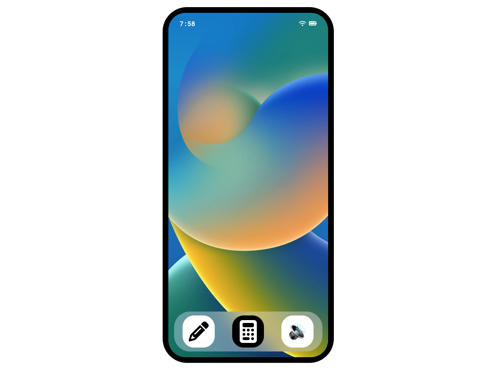

# Fake Iphone

The fake iphone website is a mock up iphone website with 3 small widget apps.

- Sketch

  - sketch is a basic etch sketch app that supports pencil eraser and a small color palette.

- Calculator

  - Calculator is a calculator app that implements full expression passing. It supports the four basic operations, negative numbers, decimals and brackets. This was implemented using the shunting yard algorithm.

- Sounds
  - sounds is a basic sound board app with a few funny sounds that can be played entertain or annoy friends.

This is a small project to help be develop my skills in using vanilla JS and working with the DOM directly. This project has helped me to better understand the DOM and how other frameworks such as react work under the hood.

### Technologies

- Typescript
- HTML
- SCSS
